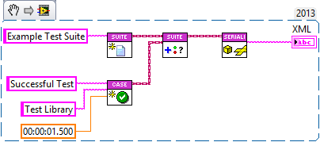

<!-- Based on https://github.com/othneildrew/Best-README-Template -->
<!-- PROJECT SHIELDS -->
<!--
*** I'm using markdown "reference style" links for readability.
*** Reference links are enclosed in brackets [ ] instead of parentheses ( ).
*** See the bottom of this document for the declaration of the reference variables
*** for contributors-url, forks-url, etc. This is an optional, concise syntax you may use.
*** https://www.markdownguide.org/basic-syntax/#reference-style-links
-->
[![Contributors][contributors-shield]][contributors-url]
[![Forks][forks-shield]][forks-url]
[![Stargazers][stars-shield]][stars-url]
[![Issues][issues-shield]][issues-url]
[![Build Status][azure-build-status-shield]][azure-build-status-url]
[![BSD-3-Clause License][license-shield]][license-url]

<!-- PROJECT LOGO -->
<br>
<p align="center">
  <a href="https://github.com/logmanoriginal/JUnit-XML">
    
  </a>

  <h3 align="center">JUnit XML</h3>

  <p align="center">
    Create JUnit test reports in XML format
    <br>
    <a href="https://github.com/logmanoriginal/JUnit-XML"><strong>Explore the docs »</strong></a>
    <br>
    <br>
    <a href="https://github.com/logmanoriginal/JUnit-XML">View Demo</a>
    <br>
    <a href="https://github.com/logmanoriginal/JUnit-XML/issues">Report Bug</a>
    <br>
    <a href="https://github.com/logmanoriginal/JUnit-XML/issues">Request Feature</a>
  </p>
</p>

## About The Project

Use **JUnit XML** to create JUnit test reports in XML format.

Supports:
* Test Suites (aggregated and non-aggregated)
* Test Cases
  * Successful
  * Failed
  * Error
  * Skipped
* Test Properties

### Built With

* [LabVIEW&trade;](https://www.ni.com/labview)

## Getting Started

To get a local copy up and running follow these simple steps.

### Prerequisites

* [LabVIEW&trade;](https://ni.com/labview) 2013 or later
* [VI Package Manager](https://vipm.io/download/)

### Installation

1. Clone the repo

   ```sh
   git clone https://github.com/logmanoriginal/JUnit-XML.git
   ```

## Usage

Here is an example that uses JUnit XML to create a simple test report.



> [!NOTE]
> There are many more examples in the [examples](/examples) folder.
> These examples are also available in Example Finder in directory view under `PNR/JUnit XML`.


## Roadmap

See the [open issues](https://github.com/logmanoriginal/JUnit-XML/issues) for a list of proposed features (and known issues).

## Further Reading

- [JUnit.xsd](https://github.com/windyroad/JUnit-Schema/blob/master/JUnit.xsd): The JUnit XML schema.

## Contributing

Contributions are what make the open source community such an amazing place to be learn, inspire, and create. Any contributions you make are **greatly appreciated**.

1. Fork the Project
2. Create your Feature Branch (`git checkout -b feature/AmazingFeature`)
3. Commit your Changes (`git commit -m 'Add some AmazingFeature'`)
4. Push to the Branch (`git push origin feature/AmazingFeature`)
5. Open a Pull Request

Keep in mind that LabVIEW&trade; VIs are binary files, which are difficult to merge.
- Only change a single VI or library.
- Avoid conflicts with other pull requests (don't work on the same libraries or VIs).
- Send VI Snippets (via issues) instead of pull requests when possible.

## License

Distributed under the BSD-3-Clause License. See [`LICENSE`](LICENSE) for more information.

## Contact

Project Link: [https://github.com/logmanoriginal/JUnit-XML](https://github.com/logmanoriginal/JUnit-XML)

## Acknowledgements

* [Caraya Unit Test Framework](https://github.com/JKISoftware/Caraya)
* [Online JUnit Parser](https://lotterfriends.github.io/online-junit-parser)

<!-- MARKDOWN LINKS & Images -->
<!-- https://www.markdownguide.org/basic-syntax/#reference-style-links -->
[contributors-shield]: https://img.shields.io/github/contributors/logmanoriginal/JUnit-XML.svg?style=for-the-badge
[contributors-url]: https://github.com/logmanoriginal/JUnit-XML/graphs/contributors
[forks-shield]: https://img.shields.io/github/forks/logmanoriginal/JUnit-XML.svg?style=for-the-badge
[forks-url]: https://github.com/logmanoriginal/JUnit-XML/network/members
[stars-shield]: https://img.shields.io/github/stars/logmanoriginal/JUnit-XML.svg?style=for-the-badge
[stars-url]: https://github.com/logmanoriginal/JUnit-XML/stargazers
[issues-shield]: https://img.shields.io/github/issues/logmanoriginal/JUnit-XML.svg?style=for-the-badge
[issues-url]: https://github.com/logmanoriginal/JUnit-XML/issues
[license-shield]: https://img.shields.io/github/license/logmanoriginal/JUnit-XML.svg?style=for-the-badge
[license-url]: https://github.com/logmanoriginal/JUnit-XML/blob/master/LICENSE.txt
[azure-build-status-url]: https://dev.azure.com/neuperger/Public/_build/latest?definitionId=28&branchName=main
[azure-build-status-shield]: https://img.shields.io/azure-devops/build/neuperger/public/28/main?style=for-the-badge&logo=azure-pipelines&label=Azure%20Pipelines
